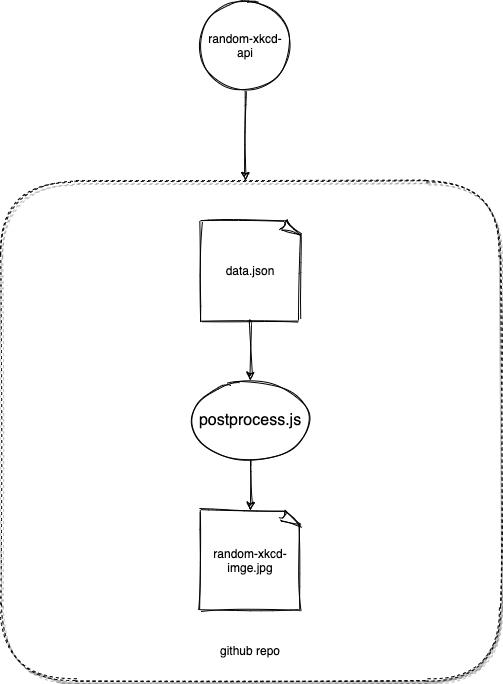

# flat-xkcd
> Exploring [Flat Data](https://octo.github.com/projects/flat-data) Workflow

Checkout a [sample-run](https://github.com/hemanth/flat-xkcd/runs/2613864101?check_suite_focus=true#step:4:3) for more details.

__Simple arch diagram:__

__Random image of the day:__

